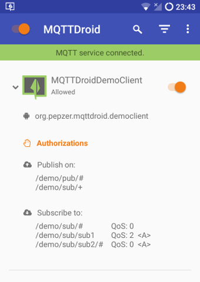

## What is MQTTDroid?
 
MQTTDroid is an Android® application that connects to an [MQTT](http://mqtt.org/) server/broker (like [Eclipse Mosquitto™](http://mosquitto.org)) and offers MQTT services to other installed applications.  
With it you can configure and manage MQTT connections, and for each client application you can allow/refuse MQTT capabilities.
MQTTDroid is built on top of [Eclipse Paho Java Client](https://www.eclipse.org/paho/).

## Build MQTTDroid

Right now there are no releases available through any channel, to test MQTTDroid you need to clone this repository and compile it from sources.  
Before compilation you need [Font Awesome](http://fontawesome.io/), you could download the [latest release from github](https://github.com/FortAwesome/Font-Awesome/archive/v4.7.0.zip), extract the archive and copy the file fonts/fontawesome-webfont.ttf to the MQTTDroid project folder inside app/src/main/assets/fonts/.

## Goals

MQTTDroid aims to offer a single always on MQTT connection that could be shared easily, securely and efficiently among client apps.  
For developers the goal is to offer a simple library that exposes MQTT functionalities, without a need to manage the connection and with asynchronously delivered messages using android services.

## Architecture

From the perspective of users and developers interested in writing clients, MQTTDroid could be separated in three main elements:

* Authorization service,
* Application UI,
* Proxy service.

### Authorization service

Client applications are only allowed to publish or subscribe to topics that have been requested and authorized.  
This request is sent to the authorization service, client applications connect to it through AIDL interface and inform MQTTDroid about the topics they are interested in, separated in subscription topics and publish topics.  
Users receive a notification each time a new request is received, so that they could allow the new application.  
The requested topics could contain the wildcards #, and + supported by the [MQTT protocol](https://github.com/mqtt/mqtt.github.io/wiki/topic_format).  
The wildcard '#' matches zero or more levels while '+' matches exactly one level.  
In the authorization request wildcards are allowed even for publish topics, but the actual publish invocation needs a completely specified topic.

For example:

 - '/mqtt/topics/#' or '/mqtt/+/client' are valid for the subscriptions field in the authorization request and topic field for the subscribe API invocation;

 - '/mqtt/topics/#' or '/mqtt/+/client' are valid for publish field in the authorization request but cannot be used in the topic field of a publish API invocation;

 - '/mqtt/topics/foo' is valid in the topic field of a publish API invocation because completely defined and is also valid in all the other cases.

### Application UI

During the first run the settings are shown immediately to configure the connection with the MQTT server.  
Once configured the Proxy service could be started/stopped through the main switch on the upper left corner.  
A status bar below the app bar shows the status of the proxy with respect to the MQTT server.  
Through the UI users can see all client applications that have sent a request, a detailed view of all requested topics is shown with a tap on the application name in the list.  
The switch to the right of the name changes the state of the client application, allowing or refusing the proxy functionalities for the app.  
When the switch is on the application is allowed, now the client could publish, subscribe, unsubscribe at any moment given that the topic is among those requested.

### Proxy service

This service manages the connection with the MQTT server and offers MQTT functionalities to client applications through an aidl interface.  
Clients connected to it could publish, subscribe, unsubscribe and receive messages for their subscriptions (if allowed).  
When a client receives a message, but the connection with the Proxy is down (e.g. the client app is not running), the Proxy service delivers the message by invoking the ProxyReceiverService of the client, which could then handle the message (i.e. by storing it, showing a notification, etc.).

## Limitations

MQTTDroid assumes that all client applications could be satisfied with just one MQTT server/broker, having multiple MQTT connections at the same time is not supported.  
A planned addition that could mitigate this limitation is the support to multiple configurations in the settings, that could be manually switched by the user.  
A workaround that is already available is to use the bridging features of MQTT Brokers in order to communicate with other brokers through it (for Mosquitto® see "Configuring Bridges" section of the [configuration file](http://mosquitto.org/man/mosquitto-conf-5.html)).  
Currently is not possible to specify a list of fallback servers to connect to, but this should be an easy addition and could change soon.

## Security

MQTTDroid uses [Eclipse Paho Java Client](https://www.eclipse.org/paho/) which supports TLS on both TCP and Websocket connections.  
It is possible to use a self-signed certificate for the server, in the settings you need to check the 'Use custom CA cert' checkbox and specify the path of a pem encoded certificate for the CA that signed the server certificate.  
There are [scripts](https://github.com/Daplie/nodejs-self-signed-certificate-example/blob/master/make-root-ca-and-certificates.sh) and [tutorials](http://mosquitto.org/man/mosquitto-tls-7.html) that could help with the creation of the necessary certificates.  

Locally on the Android® device all data from/to MQTTDroid is transmitted through AIDL interfaces protected by custom permissions:

- org.pepzer.mqttdroid.BIND_AUTH: requested to bind to the authorization service, must be granted to all client apps;
- org.pepzer.mqttdroid.BIND_PROXY: necessary to bind to the proxy service, must be granted to all client apps;
- org.pepzer.mqttdroid.BIND_RCV: requested by the clients in order to bind to their ProxyReceiverService, should be granted only to MQTTDroid.

## Code maturity

MQTTDroid is currently in pre-alpha stage. It has been tested on a limited number of devices and for a limited amount of time.  
In particular tests are needed and the documentation is limited to this file and source file documentation.  
Any feedback and/or contribution is welcome!

## Contacts
[Giuseppe Zerbo](https://github.com/pepzer), [giuseppe (dot) zerbo (at) gmail (dot) com](mailto:giuseppe.zerbo@gmail.com).

## License

Copyright © 2017 Giuseppe Zerbo.  
Distributed under the [Mozilla Public License, v. 2.0](http://mozilla.org/MPL/2.0/).

